# RabbitMQ simple webservice
# Introduction

This repository stores a simple Java application that checks if an AMQP service is running or not in a given hostname/port. 

The aim of this project is to run an entire pipeline using Jenkins that could build, test and deploy de application using Terraform, Ansible and Helm.

# Layout

The main directories/files are:

* *jenkins* - Definition to build jenkins container with the required packages to run this project. 
* *Jenkinsfile* - Jenkins declarative pipeline.
* *terraform* - Terraform module to deploy the infraestrucutre as a code with the aws provider.
* *rabbitmq* - Helm chart values to deploy rabbitmq cluster in Kubernetes.
* *ansible* - Ansible palybooks and roles to deploy K3s (Lightweight Kubernetes), RabbitMQ and Java application (as a service).
* *src* - Java application source code.
* *gradlew* - Gradle wrapper used to build and test the application.
* *gradle.sh* - Script to retreive gradle properties and store them as environment variables for usage in [spring-boot playbook](ansible/spring-boot.yml).


## Requirements: 
 - docker
 - AWS API credentials and permissions to create ec2:* resources in eu-west-1. The minimum instance type required is t2.small.


### 1. Jenkins setup
```
sudo docker build --tag jenkins-with-plugins:lts jenkins && sudo docker run -p 8080:8080 -p 50000:50000 jenkins-with-plugins:lts
```

### 2. Jenkins configuration
Jenkins login: 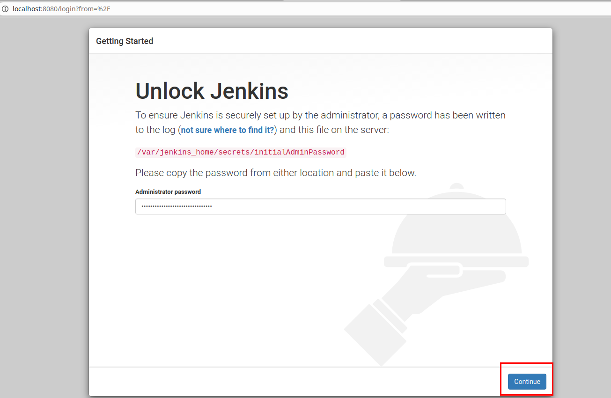

Skip plugins installation (already installed in step 1) 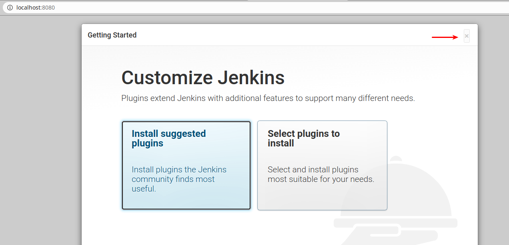

Start using Jenkins 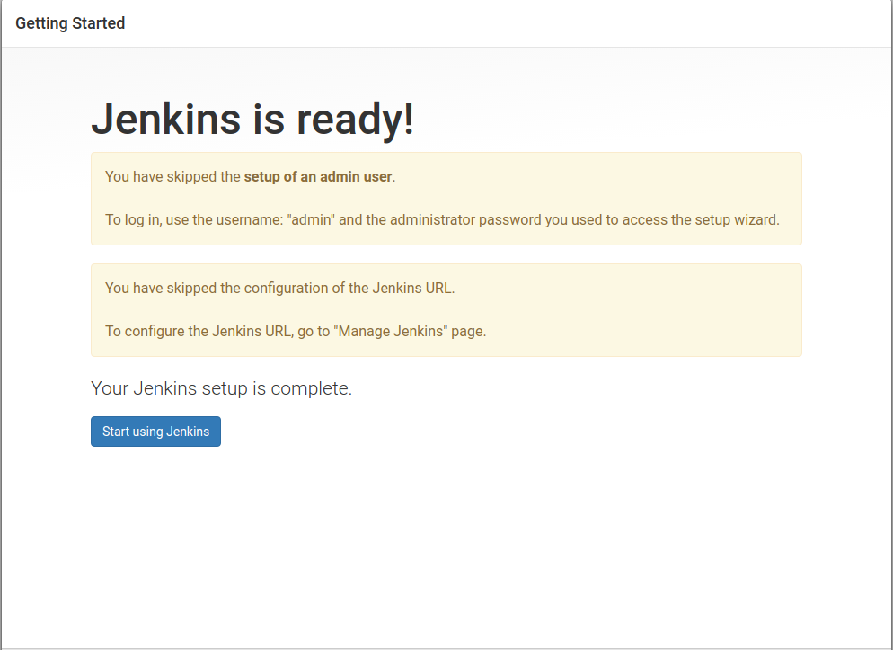

Manage Jenkins -> Manage Credentials 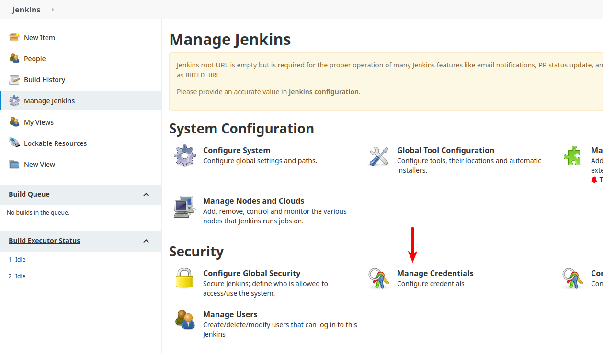

Global -> Add credentials 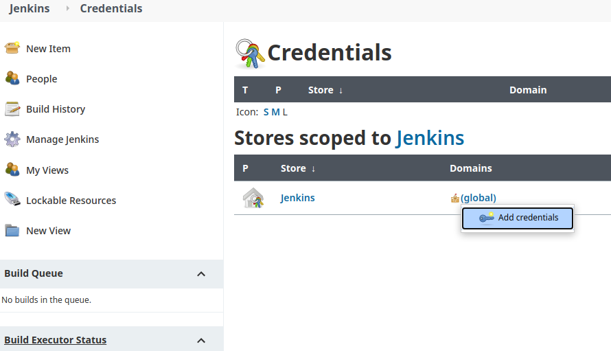

Kind -> AWS Credentials (ID and Description must be aws) 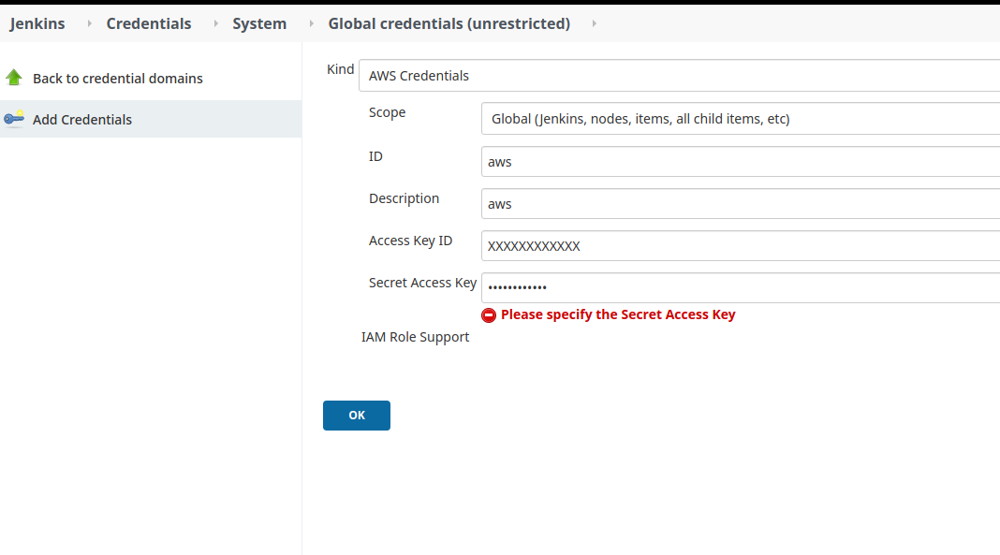

Jenkins -> New Item -> rabbit-ws -> Pipeline 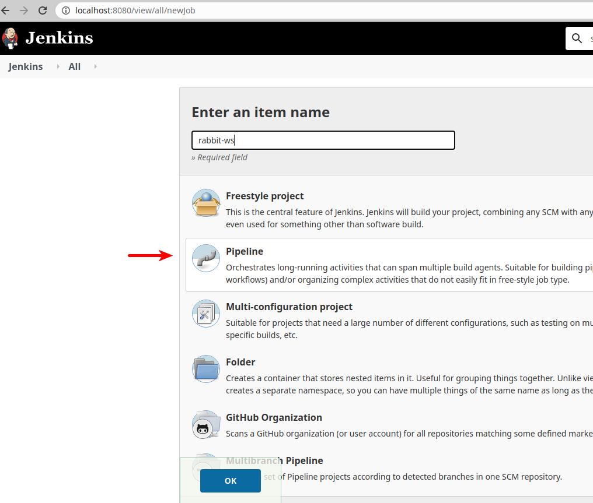

Pipeline -> Definition -> Pipeline script from SCM -> SCM -> Git 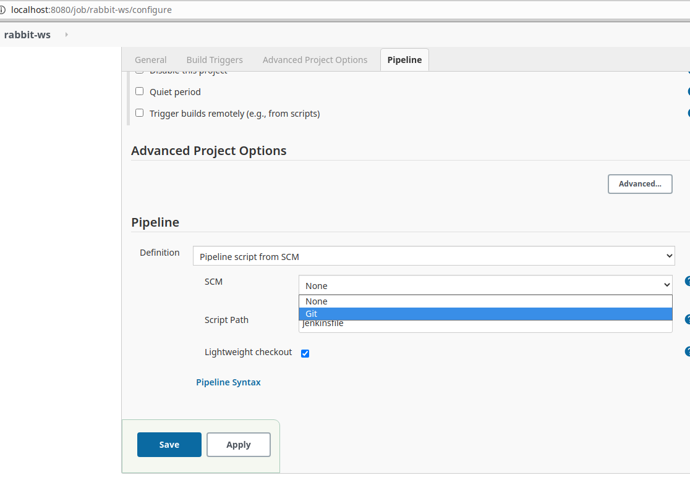

Repositories -> Repository URL -> https://github.com/juanmancebo/rabbit-ws.git 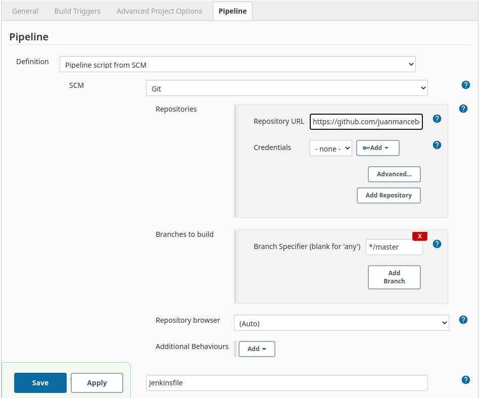


### 3. Job Build

Jenkins -> rabbit-ws -> Build Now 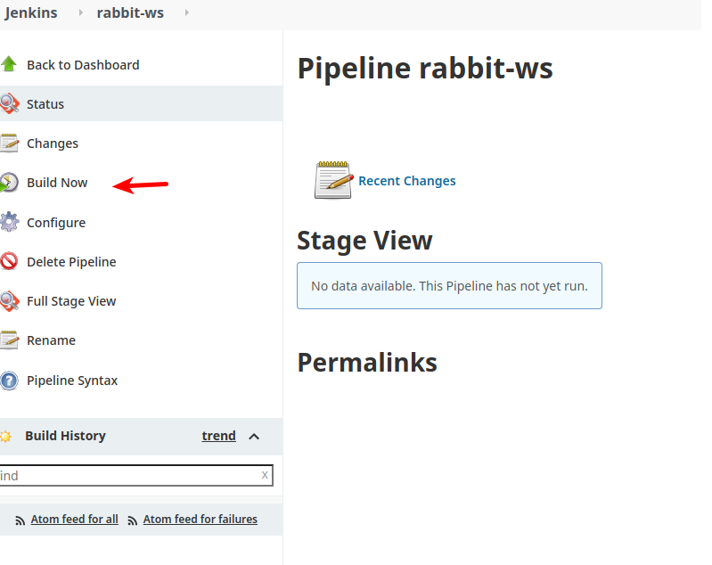

Pipeline manual action required in terraform-apply and terraform-destroy 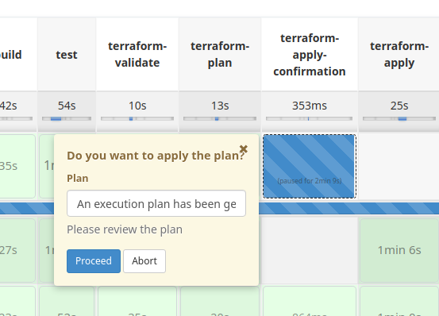

The user can see the resources that will be created/removed before take the decision to continue or abort 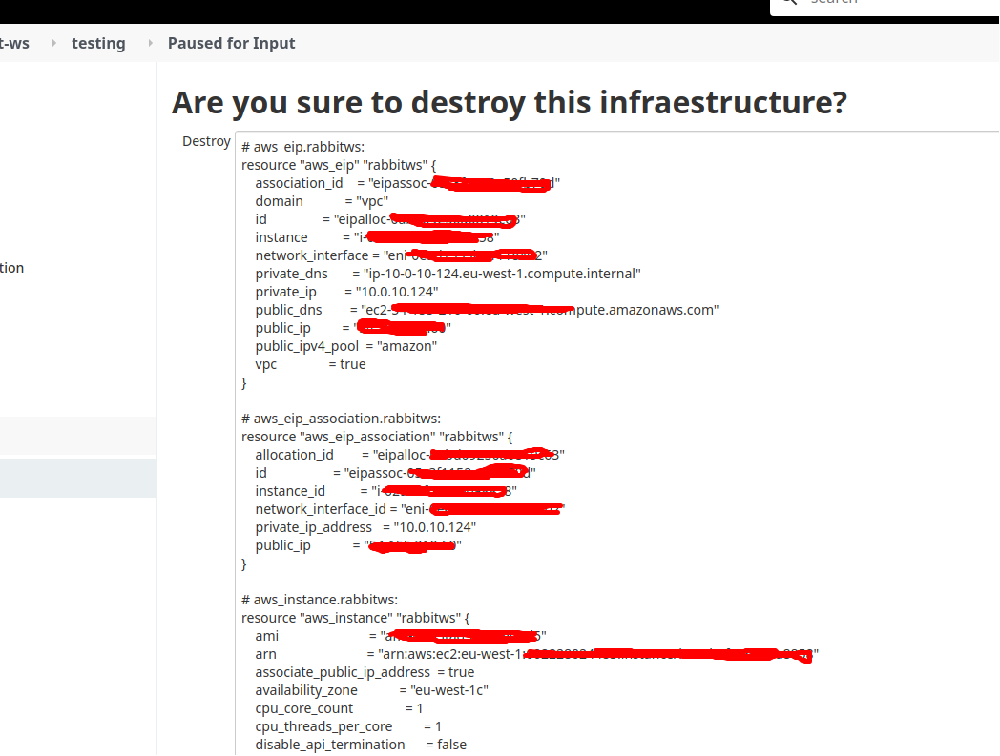

Pipeline overview 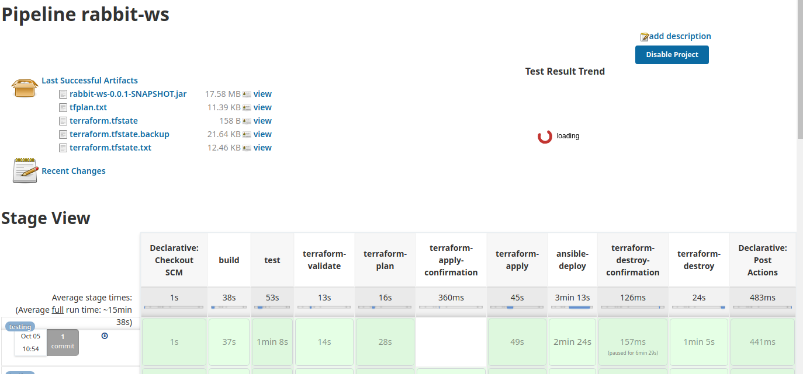

 - build: Build project complete from scratch (skipping tests)
 - test: Unit tests
 - terraform-validate: Terraform configuration files validation.
 - terraform-plan: Generates an execution plan for Terraform.
 - terraform-apply-confirmation: It requests execution confirmation to user.
 - terraform-apply: If user accepts, it applies the execution of the plan. Setup AWS infraestructure.
 - ansible-deploy: It deploys Kubernetes, RabbitMQ (on Kubernetes) and Java application (as a service)
 - terraform-destroy-confirmation: It requests destroy confirmation to user.
 - terraform-destroy: If user have accepted step before, it applies the destroy of the infraestructure.
 
The easiest way to force the unsucessful connection with RabbitMQ is to run the Jenkins job with the parameter ENVIRONMENT configured to staging i.e.
This will make the application to read the connection parameters below:
```
$cat src/main/resources/staging.properties 
amqp.host=staging
amqp.port=30000
```
Note: Other escenarios are not contempled and maybe the application doesn't catch these exepections.

### How the application works?
The application is a simple 

## Next steps (production ready)
* This project is a PoC, so it has a lack of HA and security.
1. Webservice infraestrucure: ALB + Autoscaling + Multi-AZ deployment
2. Terraform: Save tfstate in an external/centralized persistence like S3.
2. RabbitMQ: 
   1. NLB + Multi-AZ deployment (minimum of 3 replicas) in dedicated Kubernetes cluster. You can easily configure replica count in [custom_values.yaml](tabbitmq/custom_values.yaml#L19)
   2. Helm deployment using [Ansible kubernetes collection](https://docs.ansible.com/ansible/latest/collections/community/kubernetes/helm_module.html) or [Terraform helm provider](https://registry.terraform.io/providers/hashicorp/helm/latest/docs). In my opinion, nowadays both need improvements to have all helm features.
3. Java Application:
   1. It's my first Java application, for sure there are a lot of things to improve. Pull request are very very welcome :)
   2. Keep TCP connection open, instead of opening one connection per user request, and detect when the connection is dead.
4. Artifacts Management Tools:
   Nexus 
5. Code quality Tools:   
5. Jenkins:
   1. Pipeline:
      Depending on your organization, it would be better to deacouple this pipeline in two or more, to give granularity in the access to different departments in your organization.
   2. Security:
      1. Installing Jenkins on EC2 gives you the posibility to integrate it with IAM, instead of storing aws API credentials in Jenkins.
      2. [Credentials/keys masking](https://www.jenkins.io/blog/2019/02/21/credentials-masking/)
   3. HA:
      If your business requirements demand a [fault-tolerant Jenkins](https://docs.cloudbees.com/docs/cloudbees-ci/latest/traditional-install-guide/high-availability) environment, your preferred setup might be a scenario in which multiple masters with their own workers are placed in separate Availability Zones. 
